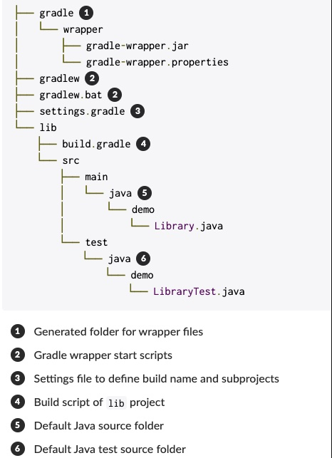
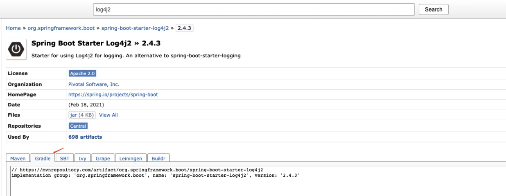

+++
author = "Leo Feng"
title = "Gradle实操笔记"
date = "2020-07-09"
description = ""
categories = [
    "编程"
]
tags = [
    "编程",
    "Java"
]
image = "matt-le-SJSpo9hQf7s-unsplash.jpg"
+++

Gradle在Java开发中可以作为项目构建工具，相比于Maven，Gradle构建更加快速，没有复杂的xml文件，取而代之的是通过脚本完成诸如依赖管理，项目构建配置，插件配置等功能。
Gradle官网提供了详细的文档，[Gradle Document](https://docs.gradle.org/current/userguide/userguide.html)，本文记录的是个人在学习以及使用Gradle过程中，使用到的特性以及遇到问题的解决办法。
- Gradle project结构

- Gradle常用命令
    -  初始化Gradle项目```gradle init```
      
```gradle
$ gradle init
Select type of project to generate:
  1: basic
  2: application
  3: library
  4: Gradle plugin
Enter selection (default: basic) [1..4] 3

Select implementation language:
  1: C++
  2: Groovy
  3: Java
  4: Kotlin
  5: Scala
  6: Swift
Enter selection (default: Java) [1..6] 3

Select build script DSL:
  1: Groovy
  2: Kotlin
Enter selection (default: Groovy) [1..2] 1

Select test framework:
  1: JUnit 4
  2: TestNG
  3: Spock
  4: JUnit Jupiter
Enter selection (default: JUnit 4) [1..4]

Project name (default: demo):
Source package (default: demo):


BUILD SUCCESSFUL
2 actionable tasks: 2 executed
```
  -  构建Gradle项目 ```gradle build```
   - 如果项目中包含了warpper script，更建议使用```./gradlew build```
 
- **gradle.properties** - Gradle运行环境配置
当我们想配置一些本地的环境变量或者针对gradle build做一些配置的时候，可以使用gradle.properties配置文件，下面是一些开发中的例子。
> - 本地jdk环境是jdk8, 但是想让Gradle在jdk11环境下编译
>     在project root下添加gradle.properties文件，增加如下配置
```org.gradle.java.home=/Library/Java/JavaVirtualMachines/adoptopenjdk-11.jdk/Contents/Home```

gradle.properties支持多种配置方式，如果在多个地方均配置有properties文件，优先级如下：
>- system properties, e.g. when -Dgradle.user.home is set on the command line.
>- gradle.properties in GRADLE_USER_HOME directory.
>- gradle.properties in project root directory.
>- gradle.properties in Gradle installation directory.

其他的关于build的详细配置，可以参考官网[Build Enviroment](https://docs.gradle.org/current/userguide/build_environment.html)
- build.gradle - 使用Gradle管理依赖

>Gradle可以使用Maven仓库，如果想在项目中优先使用本地仓库，可以在```repositories```中加入```mavenLocal()```
> 当需要添加某项依赖时，首先可以去https://search.maven.org/ 或https://mvnrepository.com/检索相应的依赖包，选择想要的版本，然后复制对应的gradle路径即可，以下两种方式是等效的。
 ```implementation group: 'org.apache.logging.log4j', name: 'log4j-core', version: '2.14.0'```
 ```implementation 'org.apache.logging.log4j:log4j-core:2.14.0'```


```java
plugins {
	id 'org.springframework.boot' version '2.4.3'
	id 'io.spring.dependency-management' version '1.0.11.RELEASE'
	id 'java'
}

group = 'io.leo'
version = '0.0.1-SNAPSHOT'
sourceCompatibility = '11'

configurations {
	compileOnly {
		extendsFrom annotationProcessor
	}
}

repositories {
	mavenLocal()
	mavenCentral()
}

dependencies {
	implementation 'org.springframework.boot:spring-boot-starter-data-jpa'
	implementation 'org.springframework.boot:spring-boot-starter-security'
	implementation 'org.springframework.boot:spring-boot-starter-web'
	implementation 'com.alibaba:fastjson:1.2.75'
	implementation group: 'org.apache.logging.log4j', name: 'log4j-core', version: '2.14.0'
	compileOnly 'org.projectlombok:lombok'
	developmentOnly 'org.springframework.boot:spring-boot-devtools'
	runtimeOnly 'mysql:mysql-connector-java'
	annotationProcessor 'org.springframework.boot:spring-boot-configuration-processor'
	annotationProcessor 'org.projectlombok:lombok'
	testImplementation 'org.springframework.boot:spring-boot-starter-test'
	testImplementation 'org.springframework.security:spring-security-test'
}

test {
	useJUnitPlatform()
}
```
