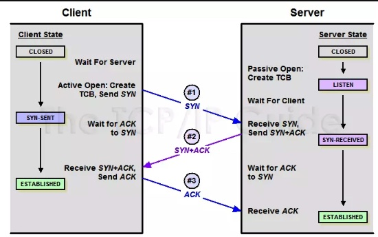
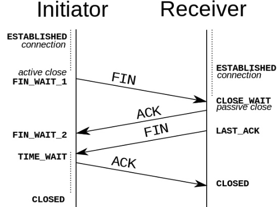

今天好好的又又又把 tcp 的三次/四次握手学习了一遍，输出一下。
## 帮助理解的重要前提
这个前提就是，tcp 本身是一个面向连接的，全双工的传输层协议。也即 bi-direction or to say full-duplex。

## 三次握手
借用一张网图：

## 四次断开
再借一张图：

## 自己总结
用自己的白话来讲就是，tcp 不管建立连接还是关闭连接，都有 sync/fin - ack 的过程，从client 和 server 出发来讲都是如此。
之所以建立连接只需要三次，是因为，当 server接到 client 的 sync 请求时，可以同时把 ack 和 sync 合并发送给 client。
而关闭连接需要四次是因为，server 接到 client 的 fin 请求并返回 ack 之后，并不一定要决定此时立刻马上也把自己关掉。
（这里就是前文提到的重要前提，因为 tcp 是全双工的，虽然你 client 不想和我连接了，但是我自己的事情还没处理完，比如server 还没接收完上次的发过来的数据等等），所以这时候***并不一定***会立刻返回fin 给 client，于是便有了四次握手。**但是**，并不一定不代表不会，猜想当 server 在收到 client 发送的 fin 之后发现自己也可以关掉连接了，于是有可能也会在返回 ack 时候同时返回 fin。这时候关闭连接实际上也是三次。
这也是我在 Stack Overflow 上看到有人问为什么 tcp 关闭连接时四次握手而不是三次握手底下看到的最简短的一个答案：It can， and sometimes it does! 😄

PS: 网图侵删
